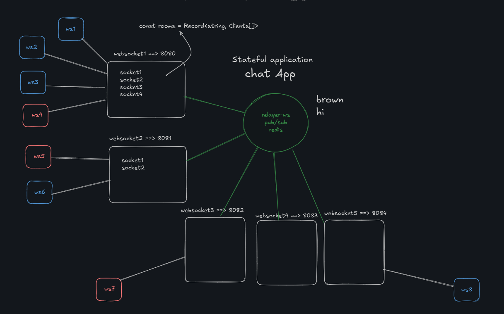

# Assignments

- [Done]Optimize the message propagation from the relayer-ws, such that the message received at relayer-ws is sent to the websocket servers that have the client connected to the same room.
  - For example, if the relayer-ws receives a message for room `room1`, it should only send that message to the websocket servers that have clients connected to `room1`.

- consider this for testing:
 - 
